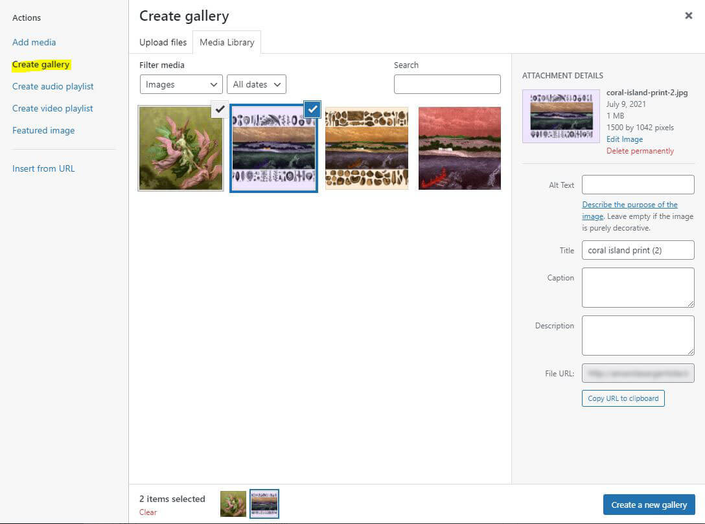

# John Fleming Artist Custom WP Theme

## Description

Custom WP theme designed for John Fleming's artist portfolio.

## Getting Started

### Dependencies

- New posts for the Portfolio Item custom post type are meant to be composed with WP's Classic editor.

### Help

- Magnific Popup gallery slider will load any images you attach for a Portfolio Item post but will only display them if uploaded as gallery type attachments
  

## Author

- [Andrew J Fleming](http://andrewjfleming.com/)

  

